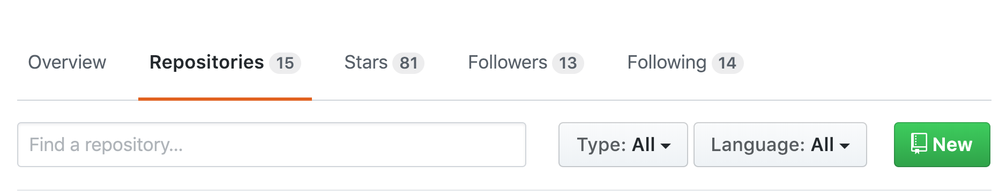
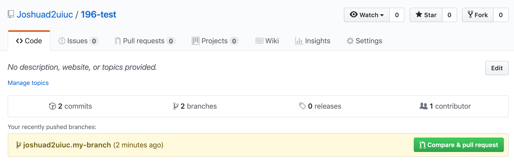
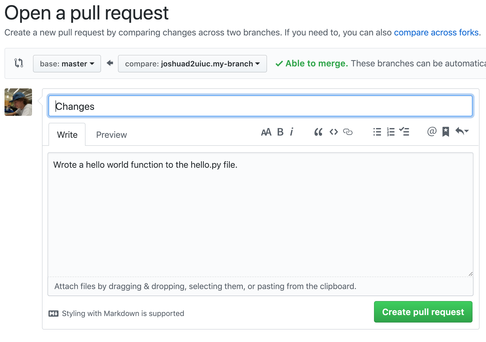
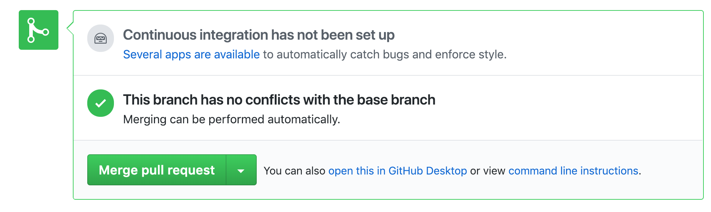

# Git
Git is a "distributed version control system". Git allows you to change and rollback to previous changes on files, work with other people on the same project at the same time, has a history of all code changes, and allows you to easily find bugs or fix errors. 

### Workflow

There are 4 environments to know of for git. 
 * There is the **working directory**, which contains files that are tracked and untracked by git, and these are the actual files you edit.
 * There is the **staging area**, which contains changes to tracked files.
 * There is the **local repository**, which contains the changes that you want to put on the remote repository.
 * The **remote repository** contains the master version of the codebase and branches that are to be merged into the master branch. This remote repository is hosted elsewhere on a server.

One can think of the first 3 environments as the **dev environment**. 

Definitions 
 * A **tracked file** is a file that the git repo knows exists. When creating a new file, you have to manually tell git that it exists. An untracked file is the case where it is not tracked.
 * The **master** branch contains the "public" version of the codebase. It is the code that you want to be used for your project or app. 
 * A **branch** is simply one version of the code. 
 * **Merging** is when you have changes on a side branch that you want in the master branch. 

### Example work flow 
First, go make a github account [here](https://github.com/join) using your @illinois.edu email address. 

To install git, open the terminal and run
```
sudo apt install git-all
```

Then, we need to set our git identity by running 
```
git config --global user.name "John Doe"
git config --global user.email johndoe@example.com
```

with your information filled out. 
Go to the repositories tab of your github account and click on new.


Now we can clone (similar to download) the repository we made on github by doing the commands they tell us here

```
echo "# 196-test" >> README.md
git init
git add README.md
git commit -m "first commit"
git remote add origin https://github.com/<your-github-username>/196-test.git
git push -u origin master
```
It should ask you for username and password as well, so just enter that information in when prompted. 

What this does is add a README.md file, which is a markdown file that is usually used to display information about what the repo is and how to install the necessary things to start working on this code. 

REMINDER - your command will be different for the ".git" link since your repo is different than my repo, replace that line, or simply copy the commands github does for you. 

So now we have initialized our first new repository! Let us add some new files and change some existing ones. 

Open up and edit the README.md file, and add a new line that says "Hello, world!". 

Now, enter the command 
```
git status
```

which will give a description of the current state of the local dev environment. As you noticed, it says that we have modified: README.md, but changes are not staged for commit. 

While we are at it, lets create a new file called "hello.py" by running the command in terminal
```
touch hello.py
```

If we do git status again, you will notice that `hello.py` is there, but it is in a new category, called untracked files. As mentioned above, untracked files are files that git does not know exist. So to let git know it exists, run the command
```
git add hello.py
```

`git status` will tell us that this change to our dev enviornment is ready to be committed to the local repository. `hello.py` is considered to be in the staging environment right now, but README.md is still red because we have not added it to the staging area. To fix this, run
```
git add README.md
``` 

to add it to the staging area.

Now that our changes our in the staging area, we are ready to commit these changes to the local repository. To do this, we need to run a new command, called `git commit`. However, we need to add a special flag to this, `-m`. What this flag does is specify a message that we want associated with our changes. In most cases, we want to describe what we changed, so our commit message and command will look something like this
```
git commit -m "Added hello.py and updated README"
```

This tells us what files we changed, how many lines we added or deleted, and if we added any new files. Now our changes that we made in our working directory have moved from the staging area into the local repository, but we want to be have our changes reflected on the master branch by updating the remote repository, to do this, we need to "push" our commits to the remote repository. 

We do this by running 
```
git push
```

Now if you look at your remote repository by going online to your github repo, you will notice that the changes you did locally are on your remote repository. You have succesfuly used git for the first time! However, most times we use git, it is not in this way. We usually create our own branch, and merge that into the master using a pull request (will go more in depth later on what this is). 

So, to create our branch, we have to do a few things first. 

**IMPORTANT** - you always want to make sure you have the most up to date version of the master branch, but in this case we do since we were the last one to push changes to the master branch. 
```
git branch joshuad2uiuc.my-branch
git checkout joshuad2uiuc.my-branch
``` 
which creates a new branch, and we can view that this was successful by running 
```
git branch
```

Next, we want to let the remote server know this exists since this is only on our dev environment, and when we want to make changes, we want to send them "upstream" to the remote repository and have the origin (the initial repository we cloned) track the changes, we can do this by running the command 

```
git push --set-upstream origin joshuad2uiuc.my-branch
# or for short
git push -u origin joshuad2uiuc.my-branch
```

Now lets make some changes! Add the following code to the python file
```python
print("Hello, world!")
```


Now, go and move the files from the working directory -> staging area -> local repository -> remote again as we did before. After this, run `git status` again and you should see that it says "Your branch is up to date with 'origin/joshuad2uiuc.my-branch'." since the place we are pushing our code to is our branch that is being tracked by the origin, not the master remote branch. 

Now, we want to go to github and find our branch and open a PR. You will notice there is a short cut provied by github that allows you to compare changes and make a pull request, click on it! 



Here, it allows us to create a title for our pull request, a description, view our commits, and view the files we have changed, try it out yourself and create a descriptive title and description. Once done, create the pull request by hitting the button. 



Now, pretend that your manager gave the thumbs up to merge, and now you the programmer can just hit "merge pull request". Notice that there is a message saying our version has no conflicts with the base branch. If there was a conflict, it would be a "merge conflict", and this merge conflict would need to be resolved somehow, which you will learn more on later from your PM.



Now your branch's changes will be reflected on the master branch! Now go ahead and delete your branch on Github and locally. 


This concludes a basic git tutorial. When doing it on your own, resort to the internet for help fixing errors such as merge conflicts and reverting changes since stackoverflow has almost every common git problem covered.

# Bash

Bash stands for Bourne again shell, a pun ad a nod to a previous shell called Bourne. A shell is a user interface that allows one to interact with an operating system. In our case, we are using a Unix-shell since we are running a Linux-based operating system. You can either directly interact with the operating system or you can write shell scripts that automate some things for you. Let us go over some of the most basic commands for navigating the terminal.

There are 3 main parts to a command, the actual command, the flags, and the arguments. The command is the function you want to run, the flag changes the behavior of that command, and the argument is some sort of input to the program. such as `rm -rf cs196/homework`, where rm is the command, -rf are the two flags r and f, and cs196/homework is the argument. 

`cd` stands for change directory, and it takes in an argument of where we should change our directory to, let us look at some examples
 * `cd /` navigates to the root directory of a Unix operating system.
 * `cd ~` or `cd` navigates to ones home directory.
 * `cd ..` navigates the parent directory. `..` stands for the directory at one level above. If you are in `~/196/homework` you will end up in `~/196` after running this command. Similarly, `.` stands for the current directory you are in.

`ls` will list the contents of the directory you are in. Some optional flags you can apply. 
 * `ls -a` includes hidden files that begin with a `.`, such as `.vimrc`, which does not show up with a simple `ls`.
 * `ls -lh` will list the files in long format with a human readable file size. Long format displays things like permissions, time last edited, and file size. 
 * `ls *.txt` will list all .txt files, the key here being the `*`.

`pwd` will list the current working directory that you are in.

`touch` will create a new file by running something like `touch file.py`.

`cp` allows you to copy a file. 
 * `cp hello.py goodbye.py` is one use case
 * `cp -R folder1/ folder2/` will copy folder1 and its contents into another folder, folder2. 

-R stands for recursive, since it is a folder it will recursively copy all the contents in that folder. 

`mv` will move files from one location to another. 
 * `mv hello.py cs196/homework/hello-homework.py` moves it into cs196/homework and changes the name
 * `mv hello.py hello-homework` can just change the name.

This differs from `cp` in that the original file is gone. In the above two cases, hello.py will no longer exist in the directories they were in before.

`rm` stands for remove. Common use cases are 
 * `rm hello.py`
 * `rm -rf folder1`. Note -f stands for force and will surpress messages asking you if you actually want to delete each of the files in it.
  
Note that this is permanent, and you cannot recover a file after using this command. 

`mkdir` will create a new directory, for example, `mkdir folder1`.

For any command, you can do `man cmd` to get information about it, and to leave the man page you can just hit `q`. For example, type `man ls` to learn more about the `ls` command. 

`cat` will ouput the contents of a file to standart output, in this car, the terminal. For example, run `cat hello.py` to see the contents of it. 

For now, practice using these commands and if you are interested, read the man pages for them and look up other commands and bash tricks!